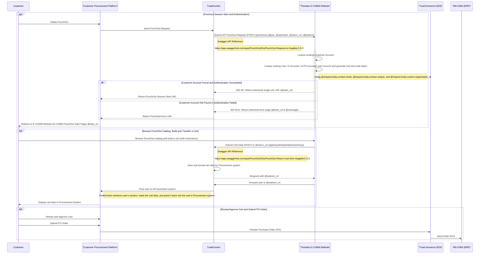

```mermaid

sequenceDiagram
    participant Customer
    participant Procurement as "Customer Procurement Platform"
    participant TradeCentric
    participant Website as "Thorlabs E-COMM Website"
    participant TrueCommerce as "TrueCommerce (EDI)"
    participant D365 as "MS D365 (ERP)"
    opt Punchout Session Start and Authentication
        Customer ->> Procurement: Initiate PunchOut
        Procurement ->> TradeCentric: Send PunchOut Request
        TradeCentric ->> Website: Submit API Punchout Request (POST) (/punchout) (@pos, @operation, @return_url, @params)
        Note right of TradeCentric: Swagger API Reference
        Note right of TradeCentric: https://app.swaggerhub.com/apis/PunchOut2Go/PunchOut-Request-to-Supplier/1.0.0#/default/punchout
        activate Website
        Website ->> Website: Lookup existing Customer Account
        Website ->> Website: Lookup existing User. If not exists, AUTO provision user account and generate one-time auth token
        Note right of Website: Using @request.body.contact.email, @request.body.contact.unique, and @request.body.custom.organization_id
        alt Customer Account Found and Authentication Succeeded
            Website -->> TradeCentric: 200 OK. Return tokenized single-use URL (@start_url)
            TradeCentric -->> Procurement: Return PunchOut Session Start URL
        else Customer Account Not Found or Authentication Failed
            Website -->> TradeCentric: 400 Error. Return tokenized error page (@start_url & @message)
            TradeCentric -->> Procurement: Return PunchOut Error URL
        end
        Procurement -->> Customer: Redirect to E-COMM Website (E-COMM PunchOut Start Page) @start_url
        deactivate Website
    end
    opt Browse PunchOut Catalog, Build and Transfer a Cart
        Customer ->> Website: Browse PunchOut catalog and build a cart (with restrictions)
        Website ->> TradeCentric: Submit Cart Data (POST) to @return_url (/gateway/link/api/id/{sessionKey})
        Note right of TradeCentric: Swagger API Reference
        Note right of TradeCentric: https://app.swaggerhub.com/apis/PunchOut2Go/PunchOut-Return-Cart-from-Supplier/1.0.0
        TradeCentric ->> TradeCentric: Save and format cart data for Procurement system
        TradeCentric -->> Website: Respond with @redirect_url
        Website ->> TradeCentric: Forward user to @redirect_url
        TradeCentric ->> Procurement: Pass user to eProcurement system
        Note left of TradeCentric: TradeCentric retrieves user's session, loads the cart data, and posts it back into the user's Procurement system.
        Procurement -->> Customer: Display cart data in Procurement System
    end
    opt Review/Approve Cart and Submit PO Order
        Customer ->> Procurement: Review and Approve Cart
        Customer ->> Procurement: Submit PO Order
        Procurement ->> TrueCommerce: Transfer Purchase Order (PO)
        TrueCommerce ->> D365: Send Order (PO)
    end
```
