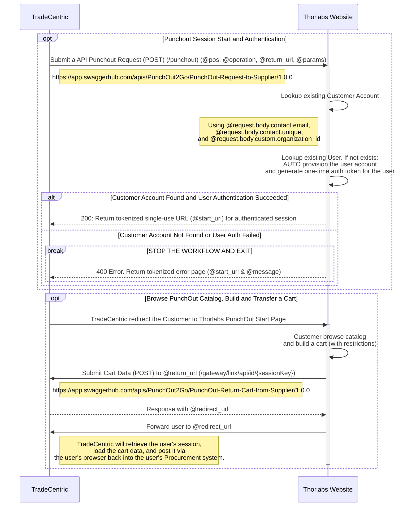

# TradeCentric PunchOut Integration with E-Commerce Platform
## Systems Integration Flow

## Key Considerations for PunchOut Integration  
Ensure the following key items are scoped and aligned internally and with the client:  

- Is there an existing in-house or third-party PunchOut integration?  
- **Supported Catalog Type**: PunchOut Catalog, Hosted Catalog, or both?  
- **Integration Flows**: Confirm the required PunchOut integration flows for the E-COMM website:  
  - PunchOut Authentication Request  
  - PunchOut Cart Transfer (Create, Edit, Inspect)  
  - PunchOut Order Request  
- **Integration Method**: Align with TradeCentric on whether to use REST API or Form POST.  
- **Field Mapping**: Identify the key Extrinsic and Custom Fields required in TradeCentric payloads.  
- **Auto-Provisioning Requirements**:  
  - Accounts (customers)  
  - Users (contacts)  
- **UI Adjustments**: Define necessary changes for the PunchOut session, including:  
  - Welcome page updates, messaging, and visibility of UI elements  
- **Catalog & Checkout Rules**: Confirm both universal and customer-specific constraints on tax, payment options, shipping, etc. Refer to the [Catalog & Checkout Rules](#catalog--checkout-rules) section for examples.

- **Rule Management**: Determine the system best suited for handling universal and customer-specific rules (e.g., CMS Backoffice, E-COMM Backoffice, TradeCentric Admin Portal).

## Catalog & Checkout Rules

### Universal Rules
Define universal rules that apply to all customers such as:
- Taxes (calcuatled vs disabled)
- Payment options (confirm to hide / disable)
- Shipping options (confirm to hide and use Customer-Specific Config to deteremine the selected shipping method)

### Customer-Specific Configuration
Identify customer-specific rules such as:
- Price restrictions
- Item deny lists
- Heavyweight item exclusions
- Discount levels
- Currencies
- Shipping configuration
  - Cost handling in Cart Transfer (line item vs. separate charge)
  - Shipping methods
  - Flag for free shipping

## Terminology

Below is a table of key terminologies used by TradeCentric to help developers understand the context.

| Term      | Definition |
|-----------|------------|
| **Buyer** | The organization purchasing goods or services through the TradeCentric PunchOut integration. |
| **Supplier** | The vendor or seller providing goods or services via the PunchOut-enabled e-commerce platform. |
| **PunchOut** | A process allowing buyers to access a supplier’s catalog from within their procurement system. |
| **Cart Transfer** | The action of sending a PunchOut shopping cart from the supplier’s e-commerce platform back to the buyer’s procurement system. |
| **Order Request** | The formal order sent from the buyer’s system to the supplier for processing. |
